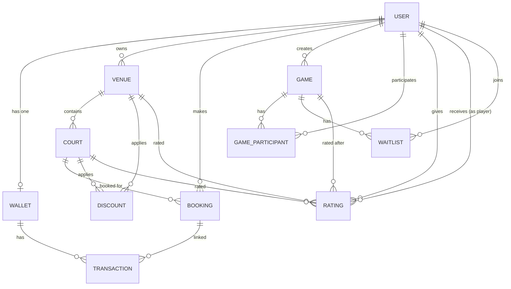

# Database Schema Documentation

## 📊 Entity Relationship Diagram

---

## 📋 Table Definitions

### Users
| Column | Type | Constraints | Description |
|--------|------|-------------|-------------|
| UserId | int | PK, Identity | Unique user ID |
| FullName | varchar(100) | Required | User's full name |
| Email | varchar(100) | Required, Unique | Login email |
| PhoneNumber | varchar(15) | Required, Indexed | Contact number |
| PasswordHash | text | Required | BCrypt hashed password |
| Role | enum(UserRole) | Required, Default: User | Admin, VenueOwner, GameOwner, User |
| IsActive | bool | Default: true | Account status |
| CreatedAt | timestamp | Default: UTC now | Registration date |
| LastLoginAt | timestamp? | Nullable | Last login |
| AggregatedRating | decimal | Default: 0 | Average player rating |
| GamesPlayed | int | Default: 0 | Total games count |
| PreferredSports | text | Default: "" | Comma-separated sport types |

### Wallets
| Column | Type | Constraints | Description |
|--------|------|-------------|-------------|
| WalletId | int | PK, Identity | Unique wallet ID |
| UserId | int | FK → Users, Unique | One-to-one with user |
| Balance | decimal(18,2) | Default: 0 | Current balance |
| CreatedAt | timestamp | Default: UTC now | Creation date |
| UpdatedAt | timestamp | | Last modification |

### Transactions
| Column | Type | Constraints | Description |
|--------|------|-------------|-------------|
| TransactionId | int | PK, Identity | Unique ID |
| WalletId | int | FK → Wallets, Indexed | Owner wallet |
| Type | enum(TransactionType) | Required | Credit or Debit |
| Amount | decimal(18,2) | Required | Transaction amount |
| BalanceAfter | decimal(18,2) | Required | Balance after transaction |
| Description | text | Required | Human-readable description |
| ReferenceId | varchar? | Indexed | Idempotency key |
| BookingId | int? | FK → Bookings | Linked booking |
| CreatedAt | timestamp | Composite index with WalletId | Transaction time |

### Venues
| Column | Type | Constraints | Description |
|--------|------|-------------|-------------|
| VenueId | int | PK, Identity | Unique ID |
| OwnerId | int | FK → Users, Indexed | Venue owner |
| Name | varchar(200) | Required | Venue name |
| Description | varchar(1000) | Nullable | Details |
| Location | varchar(500) | Required | Address/location |
| SportsSupported | text | Required | Comma-separated sport types |
| ApprovalStatus | enum | Indexed | Pending, Approved, Rejected |
| CreatedAt | timestamp | | Creation date |

### Courts
| Column | Type | Constraints | Description |
|--------|------|-------------|-------------|
| CourtId | int | PK, Identity | Unique ID |
| VenueId | int | FK → Venues (cascade), Indexed | Parent venue |
| Name | varchar(200) | Required | Court name |
| SportType | enum(SportType) | Required | Court sport type |
| BasePrice | decimal(18,2) | Required | Base hourly price |
| IsActive | bool | Composite index with VenueId | Active status |
| CreatedAt | timestamp | | Creation date |

### Discounts
| Column | Type | Constraints | Description |
|--------|------|-------------|-------------|
| DiscountId | int | PK, Identity | Unique ID |
| VenueId | int | FK → Venues, Composite indexed | Target venue |
| CourtId | int? | FK → Courts, Composite indexed | Target court |
| DiscountPercentage | decimal | Required | Percentage off (0-100) |
| ValidFrom | datetime | Composite indexed | Start date |
| ValidTo | datetime | Composite indexed | End date |
| IsActive | bool | Composite indexed | Active status |
| Description | varchar(500) | Nullable | Discount description |
| CreatedAt | timestamp | | Creation date |

### Bookings
| Column | Type | Constraints | Description |
|--------|------|-------------|-------------|
| BookingId | int | PK, Identity | Unique ID |
| UserId | int | FK → Users (restrict), Indexed | Booking user |
| CourtId | int | FK → Courts, Composite indexed | Booked court |
| SlotStartTime | datetime | Composite indexed | Slot start |
| SlotEndTime | datetime | Composite indexed | Slot end |
| Status | enum(BookingStatus) | Composite indexed | Pending/Locked/Confirmed/Cancelled/Expired/Completed |
| PriceLocked | decimal(18,2) | Required | Price at lock time |
| AmountPaid | decimal(18,2) | Default: 0 | Amount debited |
| LockExpiryTime | datetime? | Indexed | Lock expiration |
| CreatedAt | timestamp | | Creation date |
| ConfirmedAt | datetime? | | Confirmation time |
| CancelledAt | datetime? | | Cancellation time |
| CancellationReason | varchar(500) | | Reason text |
| GameId | int? | FK → Games | Linked game |

### Games
| Column | Type | Constraints | Description |
|--------|------|-------------|-------------|
| GameId | int | PK, Identity | Unique ID |
| Title | varchar(200) | Required | Game title |
| Description | varchar(1000) | Nullable | Details |
| VenueId | int | Required | Game venue |
| CourtId | int | Required | Game court |
| CreatedBy | int | FK → Users (restrict), Indexed | Game creator |
| StartTime | datetime | Composite indexed | Game start |
| EndTime | datetime | | Game end |
| MinPlayers | int | Required | Minimum players |
| MaxPlayers | int | Required | Maximum players |
| CurrentPlayers | int | Default: 0 | Current count |
| Status | enum(GameStatus) | Composite indexed | Open/Full/InProgress/Completed/Cancelled |
| IsPublic | bool | Default: true | Public visibility |
| CreatedAt | timestamp | | Creation date |
| CompletedAt | datetime? | | Completion time |

### GameParticipants
| Column | Type | Constraints | Description |
|--------|------|-------------|-------------|
| GameParticipantId | int | PK, Identity | Unique ID |
| GameId | int | FK → Games, Unique composite | Game reference |
| UserId | int | FK → Users, Unique composite | User reference |
| JoinedAt | timestamp | | Join time |

### Waitlists
| Column | Type | Constraints | Description |
|--------|------|-------------|-------------|
| WaitlistId | int | PK, Identity | Unique ID |
| GameId | int | FK → Games, Unique + Sorted composite | Target game |
| UserId | int | FK → Users, Unique composite | Waiting user |
| Position | int | Composite indexed with GameId | Queue position |
| JoinedAt | timestamp | | Join time |
| IsInvited | bool | Default: false | Invited status |

### Ratings
| Column | Type | Constraints | Description |
|--------|------|-------------|-------------|
| RatingId | int | PK, Identity | Unique ID |
| UserId | int | FK → Users, Unique composite | Reviewer |
| GameId | int | FK → Games, Unique composite | Reference game |
| TargetType | varchar(20) | Required, Unique composite | "Venue", "Court", or "Player" |
| VenueId | int? | FK → Venues, Indexed, Unique composite | Rated venue |
| CourtId | int? | FK → Courts, Indexed, Unique composite | Rated court |
| TargetUserId | int? | FK → Users (restrict), Indexed, Unique composite | Rated player |
| Score | int | Required, Range(1-5) | Star rating |
| Comment | varchar(1000) | Nullable | Review text |
| CreatedAt | timestamp | | Rating time |

---

## 🔑 Indexes

| Table | Index | Columns | Type |
|-------|-------|---------|------|
| Users | IX_Users_Email | Email | Unique |
| Users | IX_Users_PhoneNumber | PhoneNumber | Non-unique |
| Wallets | IX_Wallets_UserId | UserId | Unique |
| Transactions | IX_Transactions_ReferenceId | ReferenceId | Non-unique |
| Transactions | IX_Transactions_WalletId_CreatedAt | WalletId, CreatedAt | Composite |
| Venues | IX_Venues_OwnerId | OwnerId | Non-unique |
| Venues | IX_Venues_ApprovalStatus | ApprovalStatus | Non-unique |
| Courts | IX_Courts_VenueId | VenueId | Non-unique |
| Courts | IX_Courts_VenueId_IsActive | VenueId, IsActive | Composite |
| Discounts | IX_Discounts_VenueId_IsActive | VenueId, IsActive | Composite |
| Discounts | IX_Discounts_CourtId_IsActive | CourtId, IsActive | Composite |
| Discounts | IX_Discounts_ValidFrom_ValidTo | ValidFrom, ValidTo | Composite |
| Bookings | IX_Bookings_UserId | UserId | Non-unique |
| Bookings | IX_Bookings_CourtId_SlotTimes | CourtId, SlotStartTime, SlotEndTime | Composite |
| Bookings | IX_Bookings_Status_SlotStart | Status, SlotStartTime | Composite |
| Bookings | IX_Bookings_LockExpiryTime | LockExpiryTime | Non-unique |
| Games | IX_Games_Status_StartTime | Status, StartTime | Composite |
| Games | IX_Games_CreatedBy | CreatedBy | Non-unique |
| GameParticipants | IX_GP_GameId_UserId | GameId, UserId | Unique |
| Waitlists | IX_Waitlist_GameId_UserId | GameId, UserId | Unique |
| Waitlists | IX_Waitlist_GameId_Position | GameId, Position | Composite |
| Ratings | IX_Ratings_Unique | GameId, UserId, TargetType, VenueId, CourtId, TargetUserId | Unique |
| Ratings | IX_Ratings_VenueId | VenueId | Non-unique |
| Ratings | IX_Ratings_CourtId | CourtId | Non-unique |
| Ratings | IX_Ratings_TargetUserId | TargetUserId | Non-unique |

---

## 🔗 Relationships

| From | To | Type | Cascade |
|------|----|------|---------|
| User → Wallet | 1:1 | Required | Cascade |
| User → Venues | 1:N | Optional | Restrict |
| User → Bookings | 1:N | Optional | Restrict |
| User → Games | 1:N | Optional | Restrict |
| Venue → Courts | 1:N | Optional | Cascade |
| Court → Bookings | 1:N | Optional | Default |
| Game → Participants | 1:N | Optional | Default |
| Game → Waitlist | 1:N | Optional | Default |
| Wallet → Transactions | 1:N | Optional | Default |
| Rating → TargetUser | N:1 | Optional | Restrict |

---

## 📊 Enums

### UserRole
| Value | Name | Description |
|-------|------|-------------|
| 1 | Admin | Full system access |
| 2 | VenueOwner | Manages venues and courts |
| 3 | GameOwner | Creates and manages games |
| 4 | User | Standard player |

### BookingStatus
| Value | Name | Description |
|-------|------|-------------|
| 1 | Pending | Initial state |
| 2 | Locked | Slot locked (5 min) |
| 3 | Confirmed | Payment complete |
| 4 | Cancelled | Cancelled by user/system |
| 5 | Expired | Lock expired |
| 6 | Completed | Game finished |

### GameStatus
| Value | Name | Description |
|-------|------|-------------|
| 1 | Open | Accepting players |
| 2 | Full | Max players reached |
| 3 | InProgress | Game started |
| 4 | Completed | Game finished |
| 5 | Cancelled | Game cancelled |

### TransactionType
| Value | Name | Description |
|-------|------|-------------|
| 1 | Credit | Money added (deposit/refund) |
| 2 | Debit | Money deducted (payment) |

---

## 🌱 Seed Data

An admin user is seeded on database creation:

| Field | Value |
|-------|-------|
| Email | admin@playball.com |
| Password | Admin@123 |
| Role | Admin |
| Balance | 0 |
